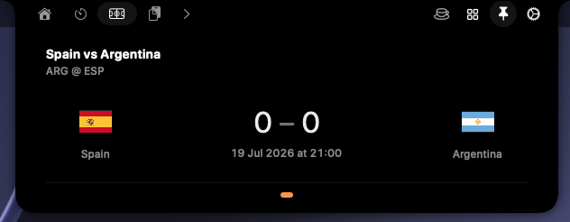
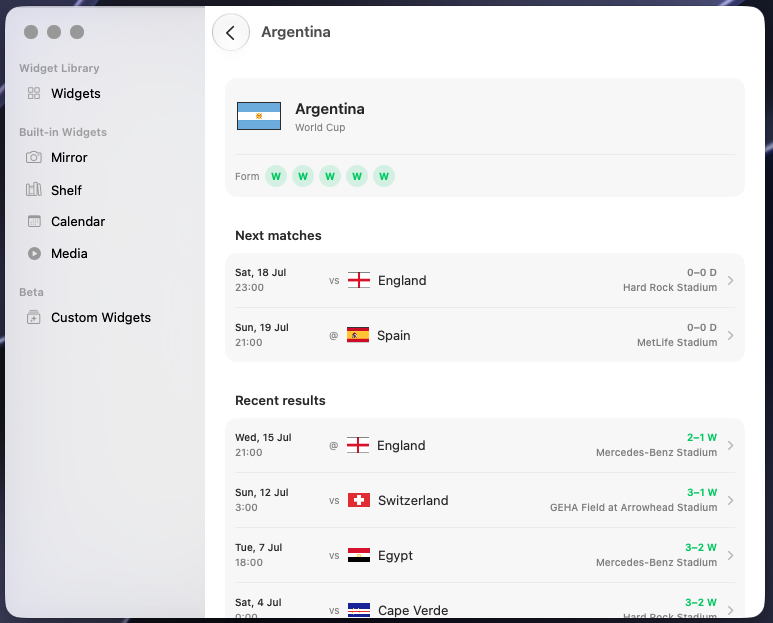
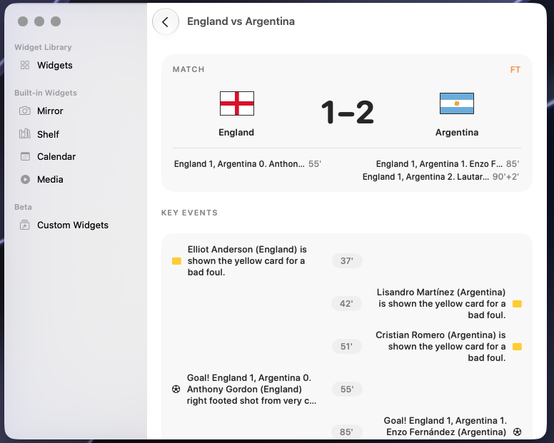
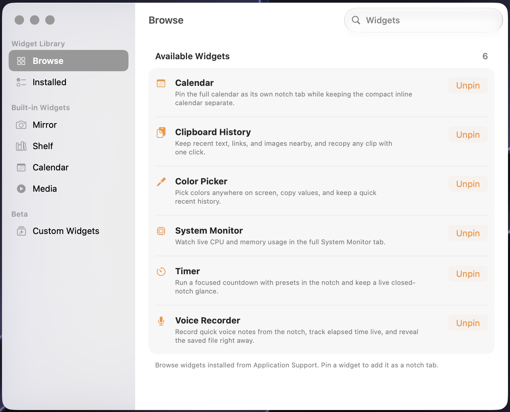

<!-- ─────────────────────────── HERO ─────────────────────────── -->
<div align="center">

# InterestingNotch


### The notch, reimagined.

A powerful, extensible take on the Mac notch — built on the foundation of boring.notch, then pushed far beyond it with native widgets, a pinnable widget library, Bluetooth connection notifications, a built-in caffeine control, and a custom-widget system you can script yourself.

<p>
  
  
  
  
  <a href="https://github.com/nodescraper/interestingnotch/releases/latest"></a>
  <a href="https://ko-fi.com/nodescraper"></a>
</p>

<p>
  <a href="https://github.com/nodescraper/interestingnotch/releases/latest"><b>Download</b></a> ·
  <a href="#getting-started">Build from source</a> ·
  <a href="#widgets">Widgets</a> ·
  <a href="#custom-widgets-beta">Custom widgets</a> ·
  <a href="#support">Support</a>
</p>

</div>

> [!NOTE]
> InterestingNotch is a heavily extended fork built for people who want the notch to actually *do* things — glanceable widgets, quick controls, and a way to wire in your own status without waiting for a feature request.

---

## Quick start

Most people should install the prebuilt app:

1. [Download the latest DMG](https://github.com/nodescraper/interestingnotch/releases/latest)
2. Open `InterestingNotch.dmg`
3. Drag `InterestingNotch.app` into `Applications`
4. Launch the app and grant the permissions for the features you want to use

Prefer to build it yourself? See [Getting started](#getting-started).

### Requirements

- macOS 14 (Sonoma) or later <!-- TODO: set your real minimum deployment target -->
- A Mac with a notch (or a Mac using the notch area on an external display)

---

## Contents

- [What it is](#what-it-is)
- [Highlights](#highlights)
- [Widgets](#widgets)
- [Sports widget](#sports-widget)
- [Custom widgets](#custom-widgets-beta)
- [Caffeine](#caffeine)
- [Bluetooth connection notifications](#bluetooth-connection-notifications)
- [Widget library](#widget-library)
- [Getting started](#getting-started)
- [Contributing](#contributing)
- [Support](#support)
- [Credits](#credits)
- [License](#license)

---

## What it is

InterestingNotch turns the empty space around the Mac notch into a compact, glanceable surface for the things you check constantly — and the things you build yourself.

It keeps everything the original boring.notch does well — media live activity, gestures, HUD replacement, the shelf, multi-display support — and layers on a redesigned settings experience, a proper widget library with pinning, a family of native widgets, first-party quick controls, and an open custom-widget system that any script can push to.

Everything runs locally. No cloud, no account.

---

## Highlights

- **Native widgets** — timer, color picker, clipboard history, calendar, voice recorder, and system monitor.
- **Pinnable widget library** — browse widgets and pin the ones you want as notch tabs.
- **Custom widgets** — let your own scripts push sneak peeks to the notch with a single JSON file.
- **Bluetooth connection notifications** — see when selected paired devices connect or disconnect.
- **Built-in Caffeine** — keep your Mac awake with timed display-awake or system-awake modes.
- **Core notch surfaces** — media activity, Shelf, Mirror, gestures, HUD replacement, and multi-display support.
- **Redesigned settings** — a cleaner, organized settings layout and a dedicated widget library view.
- **Local-first** — no network required for anything core.

---

## Widgets

A consistent, Apple-like family of widgets designed for the notch — quiet, glanceable, and interactive. These six widgets are managed from the Widget Library and can be pinned as tabs:

| Widget | What it does |
|---|---|
| **Timer / Stopwatch** | A scrubbable ruler to set a countdown, live closed-notch glance, haptic detents, and a stopwatch mode. |
| **System Monitor** | Live CPU, RAM, disk, and network ring gauges that shift color with load. |
| **Color Picker** | Pick any color on screen, copy HEX/RGB/HSL, and keep a quick recent history. |
| **Clipboard History** | Recent text, links, and images as scrollable cards — recopy or pin with one click. |
| **Calendar** | A compact month grid plus an agenda of events and reminders; tap to open in Calendar or Reminders. |
| **Voice Recorder** | Capture quick voice notes with a live waveform, elapsed time, and instant reveal of the saved file. |
| **File Converter** | Drag in an image, PDF, or text file and convert it natively — JPG/PNG/HEIC/WebP/TIFF, PDF↔image, and TXT/RTF/HTML/Markdown → PDF. |

Any widget can be **pinned** from the library to become its own notch tab.

---

## Sports widget

The Sports widget brings a full match-first flow into InterestingNotch: a live notch tab, a team page with upcoming fixtures and recent results, and a settings-side match detail page with timeline and stat comparisons.

<p align="center">
  
</p>

<p align="center">
  
</p>

<p align="center">
  
</p>

- **Pinned team priority** — starred teams take priority so the notch surfaces the next relevant match first.
- **Multi-game paging** — swipe or scroll through multiple followed matches directly inside the notch.
- **Team drill-in** — move from leagues to teams to fixtures without leaving the widget library flow.
- **Match detail** — open a full summary view with key events, stat bars, venue info, and status.
- **Live Formula 1** — constructor, team colour, gap to leader, and laps for each driver, refreshed live.

---

## Custom widgets (beta)

The most powerful part: you can push your own content to the notch without touching the app.

InterestingNotch watches a folder and turns any JSON file dropped into it into a sneak peek. It's event-driven — the app stays asleep until a file changes — so it costs effectively nothing while idle.

**Write a peek from anything** — bash, Python, a Shortcut, a cron job:

```bash
echo '{"title":"X1C","message":"78%","icon":"printer.fill","side":"split"}' \
  > ~/.interestingnotch/peeks/bambu.json
```

**The schema** (only `title` is required):

| Field | Description |
|---|---|
| `title` | Required. The main line. |
| `message` | Optional secondary line / value. |
| `icon` | Optional SF Symbol name. |
| `accent` | Optional hex color. |
| `side` | `left`, `right`, or `split` — where it sits around the notch. |
| `duration` | Optional seconds. Omit to keep it until the file is removed. |

Overwrite the same file to update a peek in place (great for live progress), delete it to clear it. Timing is entirely up to your script — the peek appears the moment the file is written.

The **Custom Widgets** panel shows live status, the folder path, and per-file errors so you can debug your scripts.

> Pairs perfectly with tools like [Bambuddy Tray](https://github.com/bcsutar/BambuddyTray) — your printer app can push print progress and a "ready!" alert straight to the notch.

---

## Caffeine

A built-in keep-awake, no extra menu-bar app required.

- Toggle from the notch header or a **global keyboard shortcut**.
- Choose display-awake (screen stays on) or system-awake (Mac stays up, screen can sleep).
- Timed modes (15m / 1h / 2h / until off) with a sneak peek when it ends.
- Always-visible state so it never drains your battery silently.

Built on native macOS power assertions — clean, revocable, no shell-outs.

---

## Bluetooth connection notifications

InterestingNotch can watch selected paired Bluetooth devices and show a notch activity when they connect or disconnect. This is connection-status monitoring, not a battery-level reader.

When a paired accessory connects or disconnects, InterestingNotch surfaces the change in the notch so it is easy to spot at a glance:

<p align="center">
  
</p>

Choose which devices can trigger notifications in Settings → Bluetooth Devices. InterestingNotch listens for connection changes instead of continuously polling in the background.

---

## Widget library

A dedicated library for managing what's in your notch. Open the Widgets page, review your pinned widgets at the top, and pin or unpin tabs without digging through a long settings list:

<p align="center">
  
</p>

- **Widgets** page for every available widget with a description.
- **Pinned Widgets** area at the top with direct drill-in to each widget's own settings page.
- **Pin / Unpin** to add or remove a widget as a notch tab.
- **Core surfaces** (Mirror, Shelf, and Media) remain available alongside the widget family.
- **Custom Widgets (beta)** to enable and monitor script-driven peeks.

The settings experience has been reorganized around this library, so adding and arranging notch content is fast and obvious.

---

## Getting started

If you want the ready-made app, use the DMG from the [latest release](https://github.com/nodescraper/interestingnotch/releases/latest).

If you want to build it yourself:

```bash
git clone https://github.com/nodescraper/interestingnotch.git
cd interestingnotch
open InterestingNotch.xcodeproj
```

Build and run in Xcode. On first launch, grant the permissions the features you use require.

---

## Contributing

Contributions, bug reports, and feature ideas are welcome. Please read [CONTRIBUTING.md](CONTRIBUTING.md) before opening a pull request, and see [SECURITY.md](SECURITY.md) for how to report a security issue.

- **Found a bug?** [Open an issue](https://github.com/nodescraper/interestingnotch/issues) with your macOS version and steps to reproduce.
- **Have an idea?** Start a discussion or issue before large changes so we can align on direction.
- **Building a custom widget?** Share it — the [custom-widget system](#custom-widgets-beta) is designed for exactly this.

---

## Support

InterestingNotch is free and open source, built and maintained in my spare time. If it earns a place in your notch, you can help keep it caffeinated:

<div align="center">

<a href="https://ko-fi.com/nodescraper"></a>

**[ko-fi.com/nodescraper](https://ko-fi.com/nodescraper)**

</div>

Support is entirely optional and never gates any feature — the app stays fully free either way. Starring the repo helps too, and costs nothing. ⭐

---

## Credits

Built on the foundation of [boring.notch](https://github.com/TheBoredTeam/boring.notch) by The Bored Team. InterestingNotch is a public fork that preserves upstream attribution and extends it with its own widget family, widget library, custom-widget system, Caffeine control, Bluetooth connection notifications, and a redesigned settings layout.

Third-party components and their licenses are listed in [THIRD_PARTY_LICENSES](THIRD_PARTY_LICENSES).

---

## License

InterestingNotch is licensed under the upstream **GNU GPL v3.0** license. See [LICENSE](LICENSE) for the full text.
