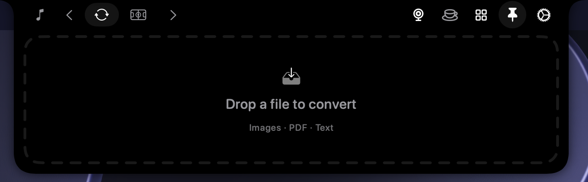

<!-- ─────────────────────────── HERO ─────────────────────────── -->
<div align="center">

# InterestingNotch


### The notch, reimagined.

A powerful, extensible take on the Mac notch — built on the foundation of boring.notch, then pushed far beyond it with native widgets, a pinnable widget library, Bluetooth connection notifications, a built-in caffeine control, and a custom-widget system you can script yourself.


</div>

> [!NOTE]
> InterestingNotch is a heavily extended fork built for people who want the notch to actually *do* things — glanceable widgets, quick controls, and a way to wire in your own status without waiting for a feature request.

---

## Quick start

Most people should install the prebuilt app:

- [Download the latest DMG](https://github.com/nodescraper/interestingnotch/releases/latest)
- Open `InterestingNotch.dmg`
- Drag `InterestingNotch.app` into `Applications`
- Launch the app and grant the permissions for the features you want to use

If you prefer to build from source, the Xcode path is still below in [Getting started](#getting-started).

---

## Contents

- [What it is](#what-it-is)
- [Highlights](#highlights)
- [Widgets](#widgets)
- [File Converter](#file-converter)
- [Sports widget](#sports-widget)
- [Custom widgets](#custom-widgets-beta)
- [Caffeine](#caffeine)
- [Bluetooth connection notifications](#bluetooth-connection-notifications)
- [Widget library](#widget-library)
- [Getting started](#getting-started)
- [Credits](#credits)
- [License](#license)

---

## What it is

InterestingNotch turns the empty space around the Mac notch into a compact, glanceable surface for the things you check constantly — and the things you build yourself.

It keeps everything the original boring.notch does well — media live activity, gestures, HUD replacement, the shelf, multi-display support — and layers on a redesigned settings experience, a proper widget library with pinning, a family of native widgets, first-party quick controls, and an open custom-widget system that any script can push to.

Everything runs locally. No cloud, no account.

---

## Highlights

- **Native widgets** — timer, color picker, clipboard history, calendar, voice recorder, system monitor, and file converter.
- **Pinnable widget library** — browse widgets and pin the ones you want as notch tabs.
- **Custom widgets** — let your own scripts push sneak peeks to the notch with a single JSON file.
- **Bluetooth connection notifications** — see when selected paired devices connect or disconnect.
- **Built-in Caffeine** — keep your Mac awake with timed display-awake or system-awake modes.
- **Core notch surfaces** — media activity, Shelf, Mirror, gestures, HUD replacement, and multi-display support.
- **Redesigned settings** — a cleaner, organized settings layout and a dedicated widget library view.
- **Local-first** — no network required for anything core.

---

## Widgets

A consistent, Apple-like family of widgets designed for the notch — quiet, glanceable, and interactive. These widgets are managed from the Widget Library and can be pinned as tabs:

| Widget | What it does |
|---|---|
| **Timer / Stopwatch** | A scrubbable ruler to set a countdown, live closed-notch glance, haptic detents, and a stopwatch mode. |
| **System Monitor** | Live CPU, RAM, disk, and network ring gauges that shift color with load. |
| **Color Picker** | Pick any color on screen, copy HEX/RGB/HSL, and keep a quick recent history. |
| **Clipboard History** | Recent text, links, and images as scrollable cards — recopy or pin with one click. |
| **Calendar** | A compact month grid plus an agenda of events and reminders; tap to open in Calendar or Reminders. |
| **Voice Recorder** | Capture quick voice notes with a live waveform, elapsed time, and instant reveal of the saved file. |
| **File Converter** | Drag in images, PDFs, or text documents and export them to a supported local format. |

Any widget can be **pinned** from the library to become its own notch tab.

---

## File Converter

File Converter turns the notch into a small, local drag-and-drop conversion desk. Drop a supported file into the widget, choose the output format, and export the result without sending the file to a cloud service.

<p align="center">
  
</p>

It supports:

- **Images** — convert between PNG, JPG, HEIC, WebP, TIFF, and PDF.
- **PDFs** — render single-page PDFs to PNG, JPG, or TIFF, or export multi-page PDFs as a folder of page images.
- **Text and documents** — convert TXT, RTF, HTML, and Markdown between text formats and export them as PDF.
- **Local temporary output** — conversion results are prepared locally and revealed from the widget when they are ready.

The converter uses native macOS image, PDF, and text frameworks. It intentionally focuses on dependable everyday formats instead of pretending to be a full document-layout engine for formats such as DOCX or EPUB.

---

## Sports widget

The Sports widget brings a match-first flow into InterestingNotch with separate views for the notch, league/team setup, team schedules, and detailed events. Follow leagues, teams, or supported tennis competitors, then pin the widget to keep the next relevant event close at hand.

<p align="center">
  
</p>

<p align="center">
  
</p>

<p align="center">
  
</p>

- **Pinned team priority** — starred teams take priority so the notch surfaces the next relevant match first.
- **Multi-game paging** — swipe or scroll through multiple followed matches directly inside the notch.
- **League and team views** — search the supported catalog, follow leagues, choose teams, and star the teams you care about most.
- **Team schedule view** — see upcoming fixtures, recent results, and direct drill-in to a match.
- **Match detail view** — open a full summary with score, match status, key events, venue information, and stat comparisons where the provider supplies them.

### Sports presentations

The notch chooses a presentation based on the sport rather than forcing every competition into the same scoreboard:

- **Team-score view** — used for soccer, basketball, American football, hockey, and baseball. It shows the teams, score, live clock or status, competition, venue, and available scoring events.
- **Leaderboard view** — used for Formula 1, PGA Tour, LPGA Tour, and UFC-style event feeds. It shows the event status and leading entries; live and finished F1 sessions provide a scrollable field with position updates.
- **Tennis sets view** — used for ATP and WTA. It shows the players, set-by-set scores, match state, winner styling, and upcoming/live/final status.

The current provider-backed catalog includes major soccer competitions such as the Premier League, La Liga, Serie A, Bundesliga, Ligue 1, MLS, Champions League, Europa League, and World Cup; NBA, WNBA, NCAAM, and NCAAW; NFL and NCAAF; NHL; MLB and NCAA Baseball; plus F1, PGA, LPGA, ATP, WTA, and UFC feeds.

---

## Custom widgets (beta)

The most powerful part: you can push your own content to the notch without touching the app.

InterestingNotch watches a folder and turns any JSON file dropped into it into a sneak peek. It's event-driven — the app stays asleep until a file changes — so it costs effectively nothing while idle.

**Write a peek from anything** — bash, Python, a Shortcut, a cron job:

```bash
echo '{"title":"X1C","message":"78%","icon":"printer.fill","side":"split"}' \
  > ~/.interestingnotch/peeks/bambu.json
```

**The schema** (only `title` is required):

| Field | Description |
|---|---|
| `title` | Required. The main line. |
| `message` | Optional secondary line / value. |
| `icon` | Optional SF Symbol name. |
| `accent` | Optional hex color. |
| `side` | `left`, `right`, or `split` — where it sits around the notch. |
| `duration` | Optional seconds. Omit to keep it until the file is removed. |

Overwrite the same file to update a peek in place (great for live progress), delete it to clear it. Timing is entirely up to your script — the peek appears the moment the file is written.

The **Custom Widgets** panel shows live status, the folder path, and per-file errors so you can debug your scripts.

> Pairs perfectly with tools like [Bambuddy Tray](https://github.com/bcsutar/BambuddyTray) — your printer app can push print progress and a "ready!" alert straight to the notch.

---

## Caffeine

A built-in keep-awake, no extra menu-bar app required.

- Toggle from the notch header or a **global keyboard shortcut**.
- Choose display-awake (screen stays on) or system-awake (Mac stays up, screen can sleep).
- Timed modes (15m / 1h / 2h / until off) with a sneak peek when it ends.
- Always-visible state so it never drains your battery silently.

Built on native macOS power assertions — clean, revocable, no shell-outs.

---

## Bluetooth connection notifications

InterestingNotch can watch selected paired Bluetooth devices and show a notch activity when they connect or disconnect. This is connection-status monitoring, not a battery-level reader.

When a paired accessory connects or disconnects, InterestingNotch surfaces the change in the notch so it is easy to spot at a glance:

<p align="center">
  
</p>

Choose which devices can trigger notifications in Settings → Bluetooth Devices. InterestingNotch listens for connection changes instead of continuously polling in the background.

---

## Widget library

A dedicated library for managing what's in your notch. Open the Widgets page, review your pinned widgets at the top, and pin or unpin tabs without digging through a long settings list:

<p align="center">
  
</p>

- **Widgets** page for every available widget with a description.
- **Pinned Widgets** area at the top with direct drill-in to each widget's own settings page.
- **Pin / Unpin** to add or remove a widget as a notch tab.
- **Core surfaces** (Mirror, Shelf, and Media) remain available alongside the widget family.
- **Custom Widgets (beta)** to enable and monitor script-driven peeks.

The settings experience has been reorganized around this library, so adding and arranging notch content is fast and obvious.

---

## Getting started

If you want the ready-made app, use the DMG from the latest release above.

If you want to build it yourself:

```bash
git clone https://github.com/nodescraper/interestingnotch.git
cd interestingnotch
open InterestingNotch.xcodeproj
```

Build and run in Xcode. On first launch, grant the permissions the features you use require.

---

## Credits

Built on the foundation of [boring.notch](https://github.com/TheBoredTeam/boring.notch) by The Bored Team. InterestingNotch is a public fork that preserves upstream attribution and extends it with its own widget family, widget library, custom-widget system, Caffeine control, Bluetooth connection notifications, and a redesigned settings layout.

---

## License

InterestingNotch is licensed under the upstream **GNU GPL v3.0** license. See [LICENSE](LICENSE) for the full text.
